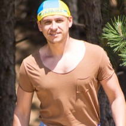

# Morozov Dmytro
_Student Front-End in RSSchool_
  
### Контактна інформація
* Phone: +380505856184
* Email: recruiterhrpartner4@gmail.com
* Discord: @marikfrost
* Telegram: [@marikfrostr](https://t.me/marikfrostr)
  
## About me
My name is Dmitry, I am 35 years old. I live in Ukraine. I want to become a Front-End developer. Until 2022 I worked in the IT field as a Recruiter. But with the end of the war, the question of retraining became very acute. So I am very grateful RSSchool for this opportunity.
  
## Projects
[Goodlife](https://github.com/MarikFrost/goodlife/deployments/github-pages) (HTML, CSS, JavaScript)  
[Furniture](https://marikfrost.github.io/furniture/) (HTML, CSS)  
[Tere](https://marikfrost.github.io/tereLandingMy/) (HTML, CSS)  
[Bonus](https://marikfrost.github.io/Bonus/) (HTML, CSS)  
[Plants](https://marikfrost.github.io/Plants/) (HTML, CSS)  
  
## My skills:
HTML, CSS, SCSS, JavaScript, Swiper
  
## Example code
```
const slideModule = (slider, interval, animationTime) => {
    interval = interval * 1000
    let sliderSize = animationSize(slider)
    let firstChild  
    let offset  
    setInterval(() => {
        firstChild = copyCutPast(slider)
        
        slider.style.transition = `transform ${animationTime}s ease-in-out`;
        offset = (sliderSize) * (-1)
        slider.style.transform = `translateX(${offset}px)`
    }, interval)

    slider.addEventListener('transitionend', () => {
        slider.style.transition = 'none'; 
        slider.style.transform = `translateX(${0}px)` 
        firstChild.remove() 
        offset = 0 
    })
}
```
  
## Experience
__02.2022 - present
***Volunter***
  
__01.2020 - 02.2022__
***Technical IT Recruiter at com.fort***
Searching for PHP, JavaScript, Python, Node.js, Java, Golang, iOS, Android, QA, DevOps specialists of all levels.

__03.2015 - 12.2019__
***IT Rectuiter at HRPartner***
My activities covered the entire recruiting cycle - from actively searching for specialists at different levels (junior, middle, senior) to sending them to clients and supporting them through all stages of interviews.
  
## Education
__Odessa National Economic University__
_Economics and Business Management, Odesa_
  
## Language
__Ukrainian__ - native
__Russian__ - native
__English__ - A2

### Social
[Linkedin](https://www.linkedin.com/in/marikfrost/)

